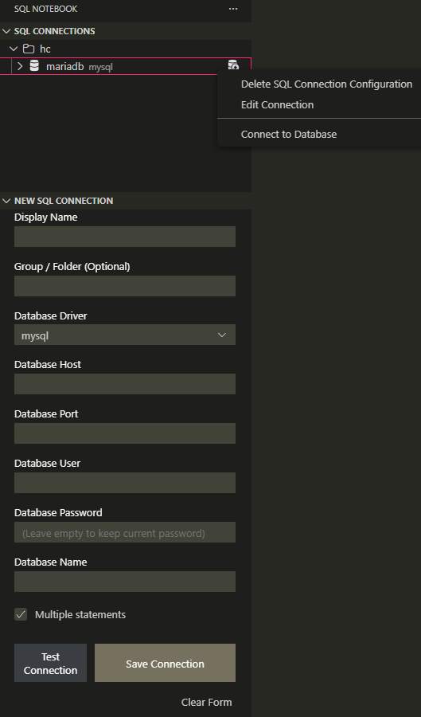

# SQL Notebook Pro

**SQL Notebook Pro** transforms VS Code into a powerful SQL IDE. Open `.sql` files as notebooks, execute query blocks, and analyze results with an Excel-like interactive grid.

> **Forked & Enhanced:** Built upon the original SQL Notebook, this Pro version adds native Intellisense, connection grouping, robust editing, portable settings, and a completely redesigned result viewer.

---

## ✨ Key Features

### 1. 🧠 Intelligent Autocomplete (NEW)
Write SQL faster with our new native Intellisense engine. The extension automatically reads your database schema to provide context-aware suggestions.

* **Tables:** Get suggestions for your tables as you type.
* **Columns:** Type a table name followed by a dot (e.g., `users.`) to instantly see that table's columns.
* **Keywords:** Full support for standard SQL keywords (SELECT, WHERE, JOIN, etc.).

### 2. Interactive Data Grid
Filter, sort, and analyze your data without writing extra queries. The new grid uses the full width of your editor and supports Excel-style filtering.
 

  

### 3. Connection Groups & Editing
Organize your database chaos. Group connections by environment (Dev, Prod, Staging) or project. Right-click any connection to **Edit** details instantly.
 

  

### 4. Smart Connection Form
Create connections safely. Includes a **Test Connection** button to verify credentials before saving. Passwords are stored securely in the system keychain, while settings are portable.
 

---

## 🚀 All Features (v1.0.0)

- **⚡ Native Intellisense:** Auto-fetch schema for MySQL, Postgres, SQLite, and MSSQL.
- **📁 Connection Grouping:** Use the "Group" field to organize connections into folders.
- **✏️ Edit Mode:** Right-click to edit Host, User, or Port without re-entering passwords.
- **☁️ Portable Settings:** Connections are saved in `settings.json`, making it easy to sync between computers (passwords remain local & secure).
- **🔄 Hot Reload:** Edit a connection and run a query immediately—no restart required.
- **📊 Export:** One-click export to **Excel** or **CSV**.

## Usage

1.  **Open a SQL File:** Open any `.sql` file, click `Open With...` (or right-click the tab), and select **SQL Notebook**.
2.  **Create Connection:** Use the "SQL Notebook" sidebar to add a connection.
    - *Tip:* Enter a "Group Name" to create a folder automatically.
3.  **Select Connection:** Click the **Select Kernel** button (top-right corner of the editor) or the current connection name to choose which database to use.
4.  **Run Queries:** Click the **Play** button on each cell (blocks are separated by empty lines).
5.  **Use Autocomplete:**
    - Start typing a command (e.g., `SEL`) to see keywords.
    - Type a table name (e.g., `users`) to see table suggestions.
    - **Crucial:** Type a dot after a table name (e.g., `users.`) to trigger the **Column List**.

## Configuration

You can customize the extension in VS Code Settings:

* **SQL Notebook: Max Result Rows:** (Default: 50) Limits the initial rows rendered for performance.
* **SQL Notebook: Query Timeout:** (Default: 30000ms) Cancels queries that take too long.

## FAQ

**Where are my passwords stored?**
Passwords are stored securely in the VS Code **Secret Storage** (your OS keychain), never in plain text.

**How do I filter data in the table?**
Click the small funnel icon (Filter) next to any column header to search or select specific values, just like in Excel.

**Can I sync my connections?**
Yes! Since connection details (Host, User, DB) are stored in `settings.json`, they sync automatically if you use VS Code Settings Sync. You will only need to re-enter passwords on the new machine for security.

---
*Based on the original work by cmoog.*