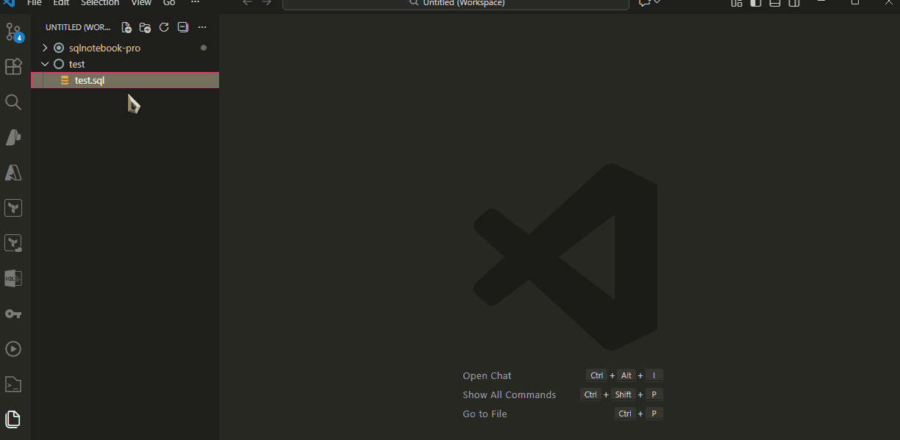
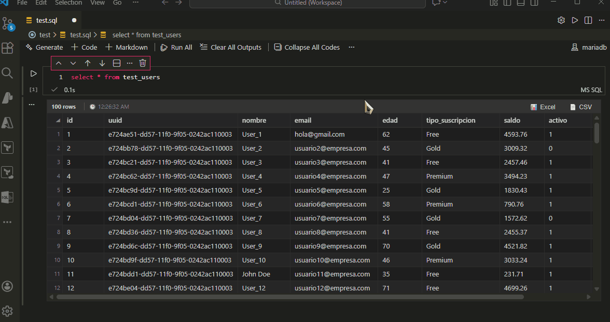

# SQL Notebook Pro


**SQL Notebook Pro** transforms VS Code into a powerful SQL IDE. Open `.sql` files as notebooks, execute query blocks, and analyze results with an Excel-like interactive grid.

> **Forked & Enhanced:** Built upon the original SQL Notebook, this Pro version adds native Intellisense, connection grouping, robust editing, portable settings, and a completely redesigned result viewer.

---

## ✨ Key Features

### 1. 🧠 Smart Intellisense & Autocomplete
Write SQL faster with our native Intellisense engine. The extension automatically reads your database schema to provide context-aware suggestions.

* **Global Search:** If a table isn't found in the current connection, the extension smartly scans all your active connections to find it.
* **Case-Insensitive:** Type `test_users` or `TEST_USERS` — we find it either way.
* **Columns:** Type a table name followed by a dot (e.g., `users.`) to instantly see that table's columns.
* **Keywords:** Full support for standard SQL keywords (SELECT, WHERE, JOIN, etc.).

### 2. Interactive Data Grid (Excel-Style)
Filter, sort, and analyze your data without writing extra queries.
* **Elastic Layout:** The grid auto-expands horizontally to fit your data.
* **Filtering:** Use the funnel icon to search, select, or exclude specific values.
* **Multi-Select:** Hold **Ctrl/Cmd** to select multiple columns, rows, or cell ranges at once.
  * Select multiple columns by Ctrl+clicking headers
  * Select multiple rows by Ctrl+clicking row numbers
  * Select multiple cell ranges by Ctrl+dragging in different areas

<br>
<div align="center">
  
  <p><em>Filtering data and selecting multiple columns with Ctrl+Click</em></p>
</div>
<br>

* **Smart Export:** Export to **Excel (XLSX)** or **CSV** using native save dialogs with auto-generated timestamps.

<br>
<div align="center">
  
</div>
<br>

### 3. Connection Groups & Editing
Organize your database chaos. Group connections by environment (Dev, Prod, Staging) or project. Right-click any connection to **Edit** details instantly without re-entering passwords.

<br>
<div align="center">
  
</div>
<br>

### 4. Smart Connection Form
Create connections safely. Includes a **Test Connection** button to verify credentials before saving.
* **Auto-Ports:** Automatically sets the default port (e.g., 5432 for Postgres) when selecting a driver.
* **Secure Storage:** Passwords are stored securely in the system keychain.

<br>
<br>

### 5. Recommended VS Code Settings
For the best visual experience (matching the look & feel of Azure Data Studio), we recommend these settings:

* **Show Line Numbers:** Essential for debugging large SQL queries.
  * Go to **Settings** (`Ctrl+,`) -> Search for **"Notebook: Line Numbers"** -> Select **"on"**.
  * *(Or add this to your JSON: `"notebook.lineNumbers": "on"`)*

* **Move Toolbar to Left:** To have the cell actions (Run, Move, Collapse) on the left side:
  * Go to **Settings** -> Search for **"Notebook: Cell Toolbar Location"** -> Select **"left"**.

* **Clean Up the Toolbar:** To remove extra native buttons and keep only the essentials:
  * Open any SQL file.
  * **Right-click** on the cell toolbar.
  * **Uncheck** options like *"Execute Above Cells"* to leave only your SQL Notebook Pro controls.

* **Remove Vertical Gap:** To avoid unnecessary empty space below small result tables:
  * Go to **Settings** -> Search for **"Scroll Beyond Last Line"** -> **Uncheck** it.

* **(Optional) Hacker UI Colors:** To get the exact "Pro" look (Pink borders & Dark background), add this to your `settings.json`:

```json
"workbench.colorCustomizations": {
    "notebook.cellEditorBackground": "#1e1f1c",
    "notebook.editorBackground": "#1e1f1c",
    "notebook.focusedCellBorder": "#F92672",
    "notebook.cellBorderColor": "#F92672",
    "focusBorder": "#F92672",
    "notebook.cellToolbarSeparator": "#F92672",
    "scrollbarSlider.activeBackground": "#F92672"
}
```
<br>

## 🚀 Feature Highlights (v2.0.0)
- **📊 Native Export:** Save results as Excel/CSV using the system dialog. Auto-opens the file after saving.
- **🛡️ Strict Mode:** Queries are now strictly separated by `-- %%` to prevent formatting errors in complex SQL blocks containing empty lines.
- **👆 Multi-Select:** Select multiple columns in the grid (Ctrl+Click).
- **🔌 Smart Ports:** Connection form auto-fills default ports (1433, 3306, 5432) based on the driver.
- **✏️ Edit Mode:** Right-click to edit Host, User, or Port without re-entering passwords.
- **☁️ Portable Settings:** Connections are saved in `settings.json`, making it easy to sync between computers.
- **🔄 Hot Reload:** Edit a connection and run a query immediately—no restart required.

## Usage

1.  **Open a SQL File:** Open any `.sql` file, click `Open With...` (or right-click the tab), and select **SQL Notebook**.
2.  **Separate Queries:** Use the standard separator `-- %%` to define independent executable cells.
    ```sql
    SELECT * FROM users

    -- %%

    SELECT * FROM orders
    ```
3.  **Create Connection:** Use the "SQL Notebook" sidebar to add a connection.
    - *Tip:* Enter a "Group Name" to create a folder automatically.
4.  **Select Connection:** Click the **Select Kernel** button (top-right corner of the editor) or the current connection name to choose which database to use.
5.  **Run Queries:** Click the **Play** button on each cell.

## Configuration

You can customize the extension in VS Code Settings:

* **SQL Notebook: Max Result Rows:** (Default: 100) Limits the initial rows rendered for performance.
* **SQL Notebook: Open After Export:** (Default: true) Automatically opens the Excel/CSV file after exporting.
* **SQL Notebook: Query Timeout:** (Default: 30000ms) Cancels queries that take too long.

## FAQ

**Where are my passwords stored?**
Passwords are stored securely in the VS Code **Secret Storage** (your OS keychain), never in plain text.

**How do I filter data in the table?**
Click the small funnel icon (Filter) next to any column header to search or select specific values, just like in Excel.

**Can I sync my connections?**
Yes! Since connection details (Host, User, DB) are stored in `settings.json`, they sync automatically if you use VS Code Settings Sync. You will only need to re-enter passwords on the new machine for security.

---
*Based on the original work by cmoog.*