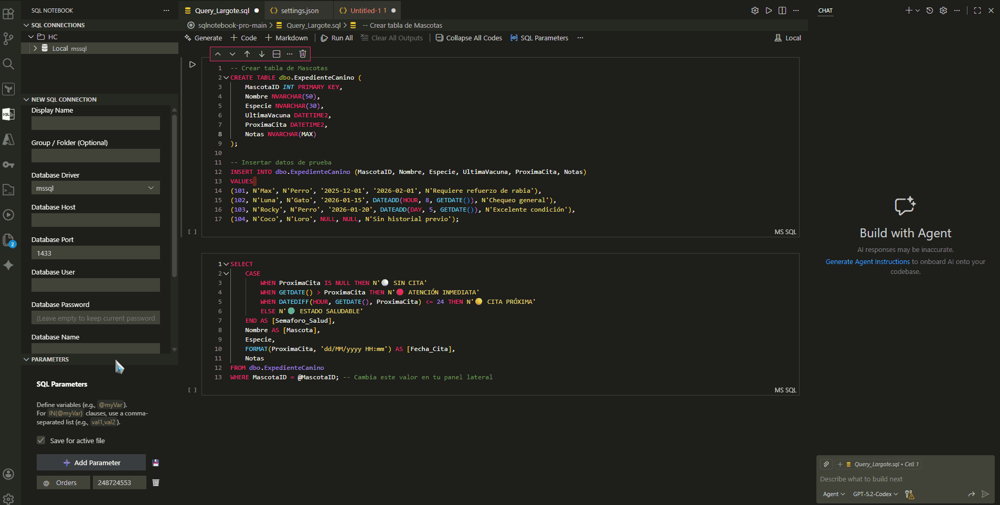
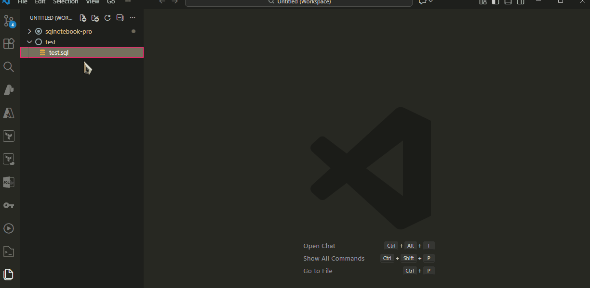
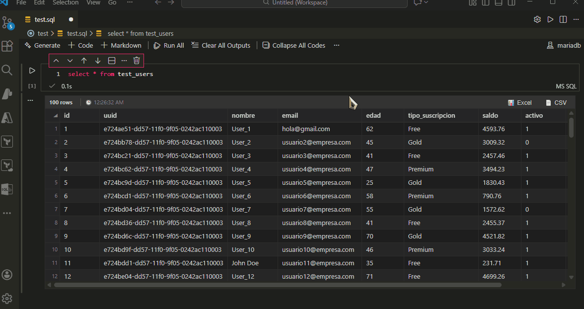
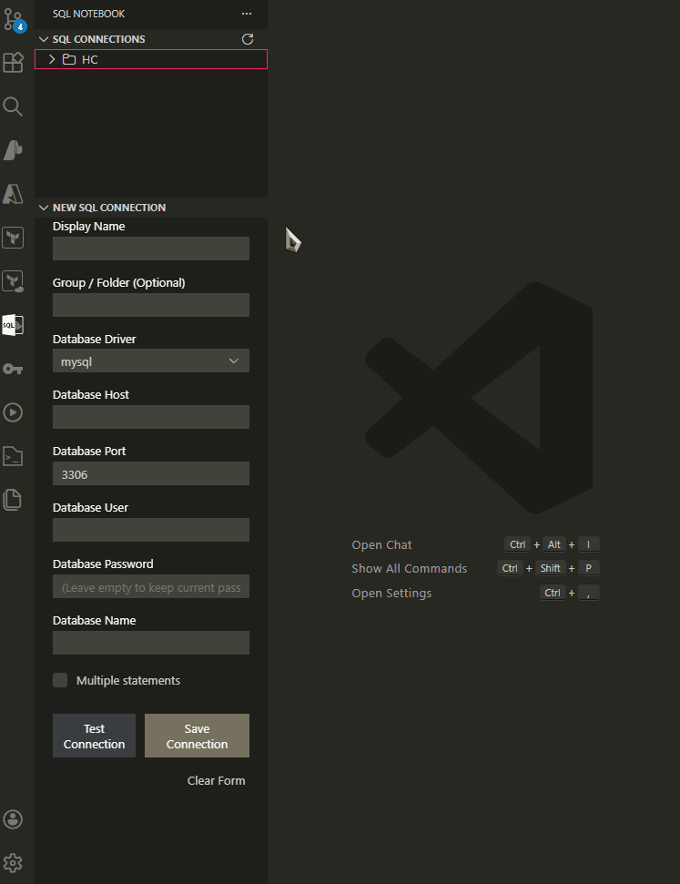

# SQL Notebook Pro


**SQL Notebook Pro** transforms VS Code into a powerful SQL IDE. Open `.sql` files as notebooks, execute query blocks, and analyze results with an Excel-like interactive grid.

> **Forked & Enhanced:** Built upon the original SQL Notebook, this Pro version adds native Intellisense, connection grouping, robust editing, portable settings, and a completely redesigned result viewer.

---

## ✨ Key Features

### 1. 🧠 Smart Intellisense & Autocomplete
Write SQL faster with our native Intellisense engine. The extension automatically reads your database schema to provide context-aware suggestions.

* **Global Search:** If a table isn't found in the current connection, the extension smartly scans all your active connections to find it.
* **Case-Insensitive:** Type `test_users` or `TEST_USERS` — we find it either way.
* **Columns:** Type a table name followed by a dot (e.g., `users.`) to instantly see that table's columns.
* **Keywords:** Full support for standard SQL keywords (SELECT, WHERE, JOIN, etc.).

### 2. ⚙️ SQL Parameters Panel
Define reusable variables and run parameterized queries with a dedicated side panel. Save per-file when needed, or keep them temporary for quick testing.

<br>
<div align="center">
  
  <p><em>Set parameters once and reuse them across queries</em></p>
</div>
<br>

#### 💡 Pro Tip: Universal Parameter Logic & Validation
* **Save (💾):** By default, saves your notebook as plain `.sql` with `-- %%` separators and embedded metadata blocks so it stays readable in text editors and Git views.

Define your parameters in the **Parameters Panel** (sidebar). List values like `Active, Pending` are automatically formatted as `'Active','Pending'` when substituted into the query.

**Required vs Optional Parameters:**
* **Required (REQ):** Edit any parameter (✏️) and check the **Required** box. If this parameter is used in your query but left empty, the extension will automatically block execution and show a validation error. This keeps your queries clean:

```sql
SELECT * FROM users
WHERE status_column IN (@Status) -- Safe: Extension blocks execution if @Status is empty!
```

* **Optional:** For parameters that aren't required, they resolve to `''` (an empty string) when left blank. You can handle this gracefully to skip the filter:

```sql
SELECT * FROM users
WHERE (@Country = '' OR country_code = @Country)
```

### 3. Interactive Data Grid (Excel-Style)
Filter, sort, and analyze your data without writing extra queries.
* **Elastic Layout:** The grid auto-expands horizontally to fit your data.
* **Filtering:** Use the funnel icon to search, select, or exclude specific values.
* **Multi-Select:** Hold **Ctrl/Cmd** to select multiple columns, rows, or cell ranges at once.
  * Select multiple columns by Ctrl+clicking headers
  * Select multiple rows by Ctrl+clicking row numbers
  * Select multiple cell ranges by Ctrl+dragging in different areas

<br>
<div align="center">
  
  <p><em>Filtering data and selecting multiple columns with Ctrl+Click</em></p>
</div>
<br>

* **Smart Export:** Export to **Excel (XLSX)** or **CSV** using native save dialogs with auto-generated timestamps.

<br>
<div align="center">
  
</div>
<br>

### 4. Connection Groups & Editing
Organize your database chaos. Group connections by environment (Dev, Prod, Staging) or project. Right-click any connection to **Edit** details instantly without re-entering passwords.

<br>
<div align="center">
  
</div>
<br>

### 5. Smart Connection Form
Create connections safely. Includes a **Test Connection** button to verify credentials before saving.
* **Auto-Ports:** Automatically sets the default port (e.g., 5432 for Postgres) when selecting a driver.
* **Secure Storage:** Passwords are stored securely in the system keychain.

<br>
<br>

### 6. Recommended VS Code Settings
For the best visual experience (matching the look & feel of Azure Data Studio), we recommend these settings:

* **Show Line Numbers:** Essential for debugging large SQL queries.
  * Go to **Settings** (`Ctrl+,`) -> Search for **"Notebook: Line Numbers"** -> Select **"on"**.
  * *(Or add this to your JSON: `"notebook.lineNumbers": "on"`)*

* **Move Toolbar to Left:** To have the cell actions (Run, Move, Collapse) on the left side:
  * Go to **Settings** -> Search for **"Notebook: Cell Toolbar Location"** -> Select **"left"**.

* **Clean Up the Toolbar:** To remove extra native buttons and keep only the essentials:
  * Open any SQL file.
  * **Right-click** on the cell toolbar.
  * **Uncheck** options like *"Execute Above Cells"* to leave only your SQL Notebook Pro controls.

* **Remove Vertical Gap:** To avoid unnecessary empty space below small result tables:
  * Go to **Settings** -> Search for **"Scroll Beyond Last Line"** -> **Uncheck** it.

* **(Optional) Hacker UI Colors:** To get the exact "Pro" look (Pink borders & Dark background), add this to your `settings.json`:

```json
"workbench.colorCustomizations": {
    "notebook.cellEditorBackground": "#1e1f1c",
    "notebook.editorBackground": "#1e1f1c",
    "notebook.focusedCellBorder": "#F92672",
    "notebook.cellBorderColor": "#F92672",
    "focusBorder": "#F92672",
    "notebook.cellToolbarSeparator": "#F92672",
    "scrollbarSlider.activeBackground": "#F92672"
}
```
<br>

## 🚀 What's in the Box
- **🧠 Intellisense:** Schema-aware autocomplete for tables, columns, and SQL keywords across all your connections.
- **🎛️ Parameters Panel:** Define `@Name` variables (text, dropdown, date, or checkbox) from the sidebar. Mark them as **Required** for automatic pre-execution validation. Values are substituted at run time and can be saved per file.
- **📊 Interactive Grid:** Filter, sort, and multi-select (Ctrl+Click) columns, rows, and cell ranges. Export to Excel/XLSX or CSV with one click.
- **🖼️ Embedded Images:** Images pasted into markdown cells are stored as notebook attachments and rendered inline — no external files needed.
- **📋 JSON Formatting:** Query results containing JSON strings are automatically pretty-printed.
- **🔌 Connection Groups:** Organize connections by environment or project. Edit host/user/port without re-entering passwords. Auto-fills default ports per driver.
- **🔒 Secure Credentials:** Passwords stored in the OS keychain via VS Code Secret Storage, never in plain text.
- **🛡️ Safe Execution:** Built-in protection automatically blocks `DELETE` and `UPDATE` statements missing a `WHERE` clause, preventing accidental data wipes.
- **☁️ Portable Settings:** Connection details live in `settings.json` — sync them across machines with VS Code Settings Sync.

## Parameter Casting Recommendations (MySQL, MSSQL, SQLite, Postgres, Trino)

Parameters are substituted as SQL string literals.
- Single value: `'text'`
- List value: `'1','2','3'` (best used with `IN (@Param)`)

If your column is numeric/date/boolean, cast as needed in your query:

```sql
-- MySQL
CAST(@Id AS UNSIGNED)
CAST(@CreatedAt AS DATETIME)

-- MSSQL
TRY_CAST(@Id AS INT)
TRY_CAST(@CreatedAt AS DATETIME2)

-- SQLite
CAST(@Id AS INTEGER)
date(@CreatedAt)

-- Postgres
CAST(@Id AS INTEGER)
CAST(@CreatedAt AS DATE)

-- Trino
CAST(@Id AS INTEGER)
CAST(@CreatedAt AS DATE)
```

For lists, prefer:

```sql
WHERE some_column IN (@Ids)
```

And for optional filters:

```sql
AND ('' IN (@Ids) OR some_column IN (@Ids))
```

## Cell Separation (`-- %%`)

SQL Notebook Pro uses an explicit separator to split a `.sql` file into notebook cells:

```sql
-- %%
```

Rules:
- Put `-- %%` on its own line.
- Everything between separators becomes one notebook cell.
- No separator means the whole file is treated as a single cell.
- This format is the canonical save format, so files stay readable in text editors and Git diffs.

Example:

```sql
SELECT * FROM users;

-- %%

SELECT * FROM orders;

-- %%

/*markdown
# Notes
This is a markdown cell.
*/
```

Tip:
- If you open an old file without separators, it may appear as one block. Add `-- %%` where you want cell boundaries.

## Usage

1. **Open a SQL File as a Notebook:** Right-click any `.sql` file in the Explorer → **Open With** → **SQL Notebook**. If the file is already open in the text editor, right-click the tab → **Reopen Editor With** → **SQL Notebook**.
2. **Add Cells:** Use the **+ SQL** or **+ Markdown** buttons at the bottom of the notebook to add new cells. Each SQL cell runs independently.
   > *Already have a plain `.sql` file with `-- %%` separators? It migrates automatically — each block becomes a separate cell.*
3. **Create a Connection:** Use the **SQL Notebook** sidebar panel to add a database connection. Enter a **Group Name** to organize it into a folder automatically.
4. **Select Connection:** Click the connection name in the top-right of the editor (or the **Select Kernel** button) to choose which database to run against.
5. **Define Parameters *(optional)*:** Click the **Parameters** icon in the notebook toolbar to open the panel. Add `@Name` variables with text, dropdown, or checkbox types — substituted at run time, saveable per file.
6. **Run Queries:** Click the **▶** button on a cell, or use **Run All** from the toolbar.

## Configuration

You can customize the extension in VS Code Settings:

* **SQL Notebook: Max Result Rows:** (Default: 100) Limits the initial rows rendered for performance.
* **SQL Notebook: Open After Export:** (Default: true) Automatically opens the Excel/CSV file after exporting.
* **SQL Notebook: Safe Delete:** (Default: true) Prevent execution of DELETE and UPDATE statements without a WHERE clause.
* **SQL Notebook: Query Timeout:** (Default: 30000ms) Cancels queries that take too long.

## FAQ

**Where are my passwords stored?**
Passwords are stored securely in the VS Code **Secret Storage** (your OS keychain), never in plain text.

**How do I filter data in the table?**
Click the small funnel icon (Filter) next to any column header to search or select specific values, just like in Excel.

**Can I sync my connections?**
Yes! Since connection details (Host, User, DB) are stored in `settings.json`, they sync automatically if you use VS Code Settings Sync. You will only need to re-enter passwords on the new machine for security.

---
*Based on the original work by cmoog.*